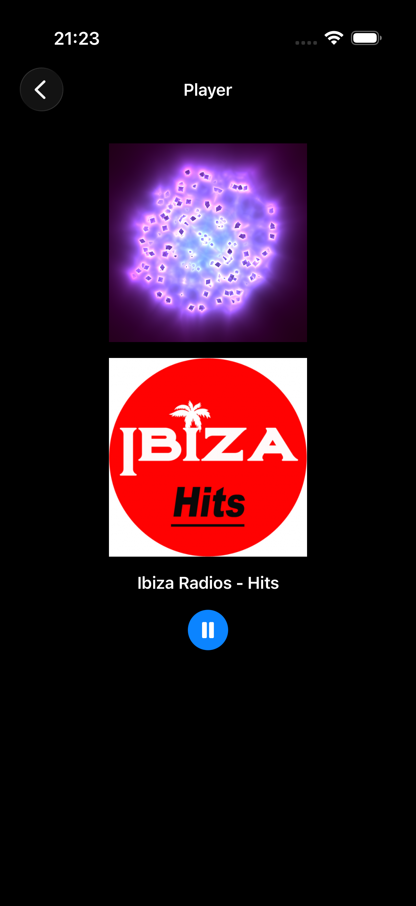
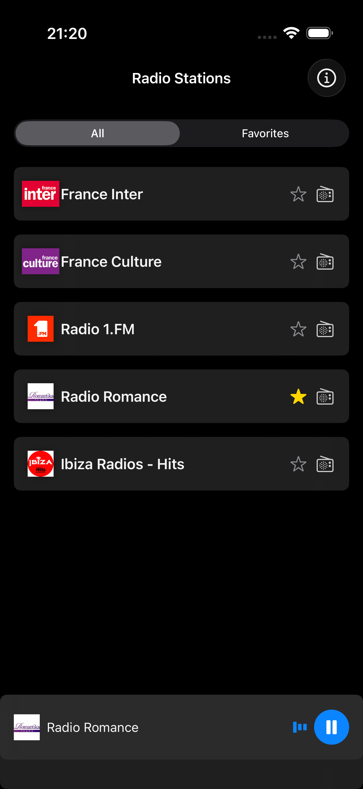

# 🎵 StreamingAudioPlayer

A modern Streaming Audio Player built with SwiftUI, featuring online radio stations, smooth playback, and stunning Metal-based animations.

## 📸 Screenshots

<div align="center">
  
  
  
</div>

## ✨ Features

**📻 Online Radio Stations**: Browse and stream from a curated list of online radio stations with real-time metadata.

**🎵 Advanced Audio Player**: Full-featured streaming audio player with play/pause, seek, and volume controls.

**⭐ Favorites Management**: Save and organize your favorite stations with SwiftData persistence.

**🎞 Metal-Powered Animations**: Stunning visualizations and smooth animations powered by Metal for optimal performance.

**🌗 Modern UI**: Clean, intuitive SwiftUI interface supporting light and dark modes with system-adaptive design.


## 🛠 Tech Stack

- **Swift 6.0+** - Latest Swift language features and concurrency model
- **SwiftUI** - Modern declarative UI framework with enhanced animations
- **SwiftData** - Local data persistence with Swift 6 concurrency support
- **The Composable Architecture (TCA)** - Modular, testable state management with actor isolation
- **Swift Concurrency** - Async/await, actors, and structured concurrency for audio streaming
- **AVFoundation** - Audio playback and streaming with modern async APIs
- **Metal** - High-performance animations and visualizations
- **Core Audio** - Advanced audio processing and management

## 🏗 Project Structure
```bash
StreamingAudioPlayer/
 Sources/
 ├── App/                      # Main iPhone app entry point with @main
 ├── Core/
 │    ├── Models/              # Data models for stations, favorites with Sendable compliance
 │    ├── Services/            # AudioService, StationService with Swift 6 concurrency
 │    └── Utils/               # Helpers, extensions, and audio utilities
 │
 ├── Features/
 │    ├── About/               # App information and credits
 │    ├── Home/                # Stations list view with search and filtering
 │    ├── LaunchScreen/        # Custom launch screen with Metal animation
 │    ├── Player/              # Audio player view with controls and visualizations
 │    └── Root/                # Main navigation with @MainActor isolation
 │
 ├── SharedUI/
 │    ├── Components/          # Reusable UI components (buttons, cards, sliders)
 │    ├── Metal/               # Metal shaders and animation renderers
 │    └── Styles/              # Common styles and design tokens
 │
 ├── Resources/
 │    └── Assets.xcassets      # Image assets, icons, and app icons
 │
 └── Tests/
      ├── UnitTests/           # Unit tests with Swift Concurrency support
      └── UITests/             # UI tests for player and navigation
```

## 🚀 Installation

### Prerequisites

* **Xcode 16** or later (Swift 6 support required)
* **iOS 18** or later for Swift 6 compatibility
* **Swift 6 Language Mode** enabled in project settings

### Steps

1. **Clone the repository**
```bash
git clone https://github.com/karkadi/StreamingAudioPlayer.git
cd StreamingAudioPlayer
```

2. **Open in Xcode 16+** - The project requires Swift 6 features

3. **Enable required Capabilities**:
   - Background Modes → Audio, AirPlay, and Picture in Picture
   - Ensure Swift 6 language mode is enabled in build settings

4. **Build and run**:
   - Select an iPhone simulator or device
   - Build and run (Cmd + R)

## 🔄 Migration to Swift 6

This project has been fully migrated to Swift 6 with comprehensive concurrency support:

### Concurrency Updates:
- **@MainActor** isolation for all UI components and audio state management
- **Async/await** for audio streaming and network operations
- **Sendable** compliance for audio data and station models
- **Structured concurrency** for background audio tasks
- **Actor isolation** for thread-safe audio state management

## 🎯 Swift 6 Features Utilized

- **Complete Concurrency Checking** - Strict actor isolation throughout the app
- **Non-Sendable Type Safety** - Protected cross-actor data access in audio services
- **Structured Task Management** - Proper cancellation for audio streaming tasks
- **MainActor Integration** - Thread-safe UI updates across all features
- **Async Audio Handling** - Modern audio session management with async/await

## 📋 Roadmap

- [ ] **Swift 6 Migration Complete** ✅
- [ ] Search & Filter. Quickly find stations by name, genre, or location with real-time search.
- [ ] Audio visualizations using Metal compute shaders
- [ ] Station recommendations based on listening history
- [ ] Sleep timer and playback scheduling
- [ ] Equalizer and audio effects
- [ ] Widgets for quick station access
- [ ] Social features (share stations, listening history)

## 🤝 Contribution

Pull requests are welcome! For major changes, please open an issue first to discuss what you'd like to change.

**Development Requirements**:
- Code must comply with Swift 6 concurrency rules
- Use @MainActor for all UI-related code and audio state
- Implement proper task cancellation for audio streaming
- Ensure Sendable compliance for cross-actor data types
- Prefer async/await over completion handlers for audio operations

## 📄 License

This project is licensed under the MIT License.
See [LICENSE](LICENSE) for details.
